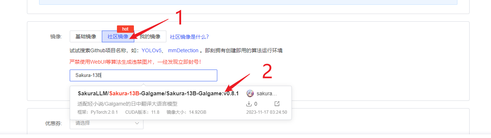
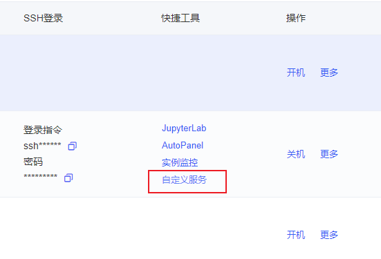
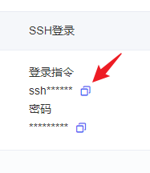

# Sakura模型部署教程-AutoDL镜像


## 部署服务器

在AutoDL租用显卡的页面下方，选择社区镜像，搜索提供的镜像名字（目前直接搜索Sakura-13B即可），点击选中，具体如下图所示：



成功部署后，通过ssh连接至服务器，首先执行以下指令：

```bash
source /etc/network_turbo
cd /root/Sakura-13B-Galgame
git pull
conda activate sakura
```


## 获取API后端链接

下面提供了两种方式获取API后端的链接。你可以使用AutoDL自带的公网映射服务将API映射到公网。但如果你不想这样做的话，也可以将API映射到本地。

获取链接后，打开[轻小说翻译机器人](https://books.fishhawk.top/personal)，输入链接，点击“测试Sakura”可以进行简单的测试。如果没有问题，则可以上传EPUB/TXT文件并点击“更新Sakura”开始翻译。

### 使用AutoDL自带的公网映射服务映射API到公网

使用下面命令启动API：

```bash
python server.py --model_name_or_path /root/Sakura-13B-Galgame/Sakura-13B-LNovel-v0_8-4bit --use_gptq_model --model_version 0.8 --trust_remote_code --listen 0.0.0.0:6006 --no-auth
```

启动后，确认程序监听的地址为`0.0.0.0:6006`。

保证程序持续运行，打开AutoDL控制台，点击服务器右侧的“自定义服务”，将打开的网址复制下来，然后在后面添加`/api/v1/generate`，就得到了API后端的链接。



### 映射API到本地

使用下面命令启动API：

```bash
python server.py --model_name_or_path /root/Sakura-13B-Galgame/Sakura-13B-LNovel-v0_8-4bit --use_gptq_model --model_version 0.8 --trust_remote_code --no-auth
```

打开AutoDL控制台，找到你的服务器的ssh命令，如下图所示：



此时复制出来后，会出现类似`ssh -p 11451 root@senpai.1919810.com`的命令，其中11451是端口，senpai.1919810.com是域名，记住这两个信息，将下面的命令补全，其中<port>换成你的端口，<domain>换成你的域名。

```bash
ssh -N -L 5000:127.0.0.1:5000 root@<domain> -p <port>
```

保证这个终端不关闭，此时AutoDL服务器上的API后端链接就映射到本地了，`http://127.0.0.1:5000/api/v1/generate`就是你的API后端的链接。 
