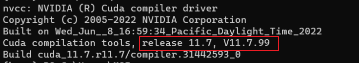

# Sakura模型部署教程-本地运行

Sakura模型要求GPU至少有16G显存，显存不够的话可以尝试使用llama.cpp将模型部分或全部卸载到CPU/内存上运行。


## 配置Python环境

考虑到大部分用户使用的是Windows系统,本教程将主要从Windows系统的视角提供部署教程。

建议选择预打包的Windows环境，方便部署。如果您具备一定的Python基础，也可以尝试手动安装。

Linux用户请参考手动安装一章自行配置。


### 打包好的Windows环境包

1. 下载压缩包 `sakura.tar.gz` 并解压缩到文件夹，链接如下，根据自己的网络环境选择其一下载即可：
    - [Google Drive](https://drive.google.com/file/d/1hxn8ECwvSF73crLTNeYRjNCSbEwqvMcs/view?usp=sharing)
    - [OneDrive(CN)](https://acgg-my.sharepoint.cn/:u:/g/personal/yukinon_srpr_cc/Ea4oE9XBvthAtyRfYn_JbuMB1CImDYOHcl77ryk_rXZIUw?e=rF8Jdx)，密码：sakura
    
2. 解压缩后，你现在应该有一个叫做 `sakura` 的文件夹，里面有一个 `python.exe` 文件。现在你可以用 Python/Anaconda 两种方式使用 Sakura 环境：
    - **Python**：直接使用里面的`python.exe`来运行 Python 脚本。注意使用的时候，不要用默认的 `python` 命令，而要使用绝对路径或相对路径指向下载的 `python.exe`。 例如：
      
        ```python
        python xxx.py				# 错误，使用的是系统的python解释器
        sakura/python.exe xxx.py	# 正确，使用的是下载的Sakura的python解释器
        ```
        
    - **Anaconda**：将解压缩的文件夹 `sakura` 放到 Anaconda 的 `envs` 目录下，运行`conda activate sakura`来应用环境。


### 手动安装

1. 安装 Python。要求安装 Python3.10 或以上版本，推荐 Python3.10。

2. 安装 torch。打开终端，输入指令`nvcc -V` ，并查看此处release后面显示的版本。
   
    
    
    如果你的CUDA版本是12.0以上，则运行以下命令：
    
    ```bash
    pip3 install torch torchvision torchaudio --index-url https://download.pytorch.org/whl/cu121
    ```
    
    如果你的CUDA版本是11.x，则运行以下命令：
    
    ```bash
    pip3 install torch torchvision torchaudio --index-url https://download.pytorch.org/whl/cu118
    ```
    
3. 安装 bitsandbytes 和 auto-gptq。
   
    - bitsandbytes：
    
    ```bash
    pip install https://github.com/jllllll/bitsandbytes-windows-webui/releases/download/wheels/bitsandbytes-0.40.2-py3-none-win_amd64.whl
    ```
    
    - auto-gptq：根据你的CUDA版本和Python版本进行安装，这里使用Python3.10作为例子：
    
    ```bash
    # CUDA 11.7（11.7及以前）
    pip install https://github.com/PanQiWei/AutoGPTQ/releases/download/v0.4.2/auto_gptq-0.4.2+cu117-cp310-cp310-win_amd64.whl
    # CUDA 11.8（11.8及以后）
    pip install https://github.com/PanQiWei/AutoGPTQ/releases/download/v0.4.2/auto_gptq-0.4.2+cu118-cp310-cp310-win_amd64.whl
    ```
    
    如果出现CUDA版本问题，可先尝试将CudaToolkit更新/降级至11.7/11.8版本
    
4. 安装其他依赖。
   
    运行以下命令：
    
    ```bash
    pip3 install transformers==4.33.2 sentencepiece xformers
    ```


## 下载模型

TODO


## 翻译Epub/Txt

1. 如果你想直接本地翻译轻小说Epub或文本：
   
    执行以下命令克隆项目仓库
    
    ```bash
    git clone https://github.com/SakuraLLM/Sakura-13B-Galgame.git
    ```
    
    克隆后进入该目录，将你想翻译的Epub文件或文本文件放入仓库根目录中，并重命名为novel.epub（或novel.txt），如果你想翻译Epub文件，还需要创建一个文件夹output。
    
    
    
    完成后打开终端，执行以下命令（注意系统）：
    
    - 如果你想翻译Epub文件：
      
        ```bash
        # 参数说明：
        # --model_name_or_path：模型本地路径或者huggingface仓库id。
        # --model_version：模型版本，本仓库README表格中即可查看。可选范围：['0.1', '0.4', '0.5', '0.7', '0.8']
        # --use_gptq_model：如果模型为gptq量化模型，则需加此项；如是全量模型，则不需要添加。
        # --text_length：文本分块的最大单块文字数量。
        # --data_path：日文原文Epub小说文件路径。
        # --data_folder：批量翻译Epub小说时，小说所在的文件夹路径
        # --output_folder：翻译后的Epub文件输出路径（注意是文件夹路径）。
        # --trust_remote_code：是否允许执行外部命令（对于0.5，0.7，0.8版本模型需要加上这个参数，否则报错）。
        # --llama：如果你使用的模型是llama家族的模型（对于0.1，0.4版本），则需要加入此命令。
        # 以下为一个例子
        # Linux的例子
        python translate_epub.py \
            --model_name_or_path SakuraLLM/Sakura-13B-LNovel-v0_8-4bit \
            --trust_remote_code \
            --model_version 0.8 \
            --use_gptq_model \
            --text_length 512 \
            --data_path novel.epub \
            --output_folder output
        # Windows的例子
        python translate_epub.py --model_name_or_path SakuraLLM/Sakura-13B-LNovel-v0_8-4bit --trust_remote_code --model_version 0.8 --use_gptq_model --text_length 512 --data_path novel.epub --output_folder output
        ```
        
    - 如果你想翻译文本文件：
      
        ```bash
        # 参数说明：
        # --model_name_or_path：模型本地路径或者huggingface仓库id。
        # --model_version：模型版本，本仓库README表格中即可查看。可选范围：['0.1', '0.4', '0.5', '0.7', '0.8']
        # --use_gptq_model：如果模型为gptq量化模型，则需加此项；如是全量模型，则不需要添加。
        # --text_length：文本分块的最大单块文字数量。每块文字量将在text_length/2至text_length内随机选择。
        # --compare_text：是否需要输出中日对照文本，如需要，则需加此项；如不需要则不要添加。
        # --data_path：日文原文文件路径
        # --output_path：翻译(或对照)文本输出文件路径
        # --trust_remote_code：是否允许执行外部命令（对于0.5，0.7，0.8版本模型需要加上这个参数，否则报错。
        # --llama：如果你使用的模型是llama家族的模型（对于0.1，0.4版本），则需要加入此命令。
        # 以下为一个例子
        # Linux的例子
        python translate_novel.py \
            --model_name_or_path SakuraLLM/Sakura-13B-LNovel-v0_8-4bit \
            --trust_remote_code \
            --model_version 0.8 \
            --use_gptq_model \
            --text_length 512 \
            --data_path novel.txt \
            --output_path novel_translated.txt
        # Windows的例子
        python translate_novel.py --model_name_or_path SakuraLLM/Sakura-13B-LNovel-v0_8-4bit --trust_remote_code --model_version 0.8 --use_gptq_model --text_length 512 --data_path novel.txt --output_path novel_translated.txt
        ```
        
    
    这里，如果你位于中国大陆地区，那么到huggingface.co的网络可能存在无法连接的问题，导致无法拉取模型。你可以从modelscope仓库拉取模型并存到本地，并将上文命令里的`--model_name_or_path`的值改为本地模型文件夹的路径。
    


## 运行API后端

1. 克隆Github仓库，并进入仓库目录
   
    ```bash
    git clone https://github.com/SakuraLLM/Sakura-13B-Galgame
    ```
    
    克隆后，使用`git checkout dev_server`切换到api后端的分支。
    
2. 安装所需的环境（Windows）：先按照上文《安装环境（Windows）》安装完成后，执行下面的命令：
   
    ```jsx
    pip install scipy numpy fastapi[all] hypercorn coloredlogs dacite asyncio sse-starlette
    ```
    
3. 安装所需的环境（Linux）：可以直接执行下面的指令。需要上文中提到的cuda版本，如果是12.x则无需操作，如果是11.x请在requirements.txt里将第一行注释掉，并将第二行取消注释。
   
    ```bash
    pip install -r requirements.txt
    ```
    
4. 运行程序
   
    ```bash
    # 参数解释（与上文本地翻译相同的参数不再进行解释）：
    # --listen：指定要监听的IP和端口，格式为<IP>:<Port>，如127.0.0.1:5000。默认为127.0.0.1:5000
    # --auth：使用认证，访问API需要提供账户和密码。
    # --no-auth：不使用认证，如果将API暴露在公网可能会降低安全性。
    # --log：设置日志等级。
    # 下面为一个使用v0.8-4bit模型，同时不使用认证，监听127.0.0.1:5000的命令示例。
    # 这里模型默认从huggingface拉取，如果你已经将模型下载至本地，可以将--model_name_or_path参数的值指定为本地目录。
    python server.py --model_name_or_path SakuraLLM/Sakura-13B-LNovel-v0_8-4bit --use_gptq_model --model_version 0.8 --trust_remote_code --no-auth
    ```
    
5. 打开[轻小说翻译机器人](https://books.fishhawk.top/personal)，将你的API后端链接输入到下图的输入框中。举个例子，假设Api监听的是5000端口，那么链接就是 `http://127.0.0.1:5000/api/v1/generate`。

6. 点击“测试Sakura”可以进行简单的测试。如果没有问题，则可以上传EPUB/TXT文件并点击“更新Sakura”开始翻译。

7. 将API映射到公网：使用CF Tunnel将API监听的端口映射到CF，可以参考[这个教程](https://lxnchan.cn/cf-tunnel.html)或者[这个教程](https://zhuanlan.zhihu.com/p/621870045)。


## 可能遇到的问题

1. 使用llama.cpp后端运行API
    - 如果你是Windows系统，请通过以下命令安装新依赖：
    
    ```bash
    python -m pip install llama-cpp-python --prefer-binary --extra-index-url=https://jllllll.github.io/llama-cpp-python-cuBLAS-wheels/AVX2/cu117
    ```
    
    - 安装依赖后，使用以下例子启动API：
    
    ```jsx
    # --use_gpu：如果需要使用GPU推理则使用，只需要纯CPU推理的话请删掉。
    python server.py --listen 0.0.0.0:5000 --llama_cpp --trust_remote_code --model_name_or_path 你的GGUF模型位置 --model_version 0.8 --no-auth --log info --use_gpu
    ```
    
2. 使用llama.cpp后端运行脚本
    - 如果你是Windows系统，请通过以下命令安装新依赖：
    
    ```bash
    python -m pip install llama-cpp-python --prefer-binary --extra-index-url=https://jllllll.github.io/llama-cpp-python-cuBLAS-wheels/AVX2/cu117
    ```
    
    - 安装依赖后，请使用以下参数和例子（以翻译文本的脚本为例，翻译Epub的脚本同理）：
    
    ```bash
    # 参数说明：
    # --model_name_or_path：GGUF格式模型本地路径。
    # --model_version：模型版本，本仓库README表格中即可查看。可选范围：['0.1', '0.4', '0.5', '0.7', '0.8']
    # --text_length：文本分块的最大单块文字数量。
    # --compare_text：是否需要输出中日对照文本，如需要，则需加此项；如不需要则不要添加。
    # --data_path：日文原文文件路径
    # --output_path：翻译(或对照)文本输出文件路径
    # --trust_remote_code：是否允许执行外部命令（对于0.5，0.7，0.8版本模型需要加上这个参数，否则报错）
    # --llama_cpp：使用llama.cpp载入模型
    # --use_gpu：使用GPU载入llama.cpp支持的模型
    # --n_gpu_layers：设置载入GPU的模型层数。如果指定了use_gpu同时此处设置为0（或者不设置），则会将模型所有层都放入GPU中。如果没有指定use_gpu同时此处设置为0（或者不设置），则会进入纯CPU推理模式。
    # 以下为一个例子
    # Windows的例子
    python .\translate_novel.py --model_name_or_path 你的模型路径 --model_version 0.8 --data_path text.txt --output_path output.txt --llama_cpp --use_gpu --trust_remote_code
    ```
    
3. `ModuleNotFoundError: No module named ‘sampler_hijack’`
   
    少下了一个文件`sampler_hijack.py`，请完整克隆仓库。
    
4. 出现类似`SSLError/ConnectionError/MaxRetryError`等连接不上huggingface.co的报错
   
    中国大陆网络问题导致的，可重试或使用魔法；或者检查`model_name_or_path`参数有没有写错。
    
5. `CUDA extension not installed.`
   
    安装的autogptq与你的环境不匹配，需要卸载autogptq `pip uninstall autogptq` 之后，使用源码安装：
    
    
